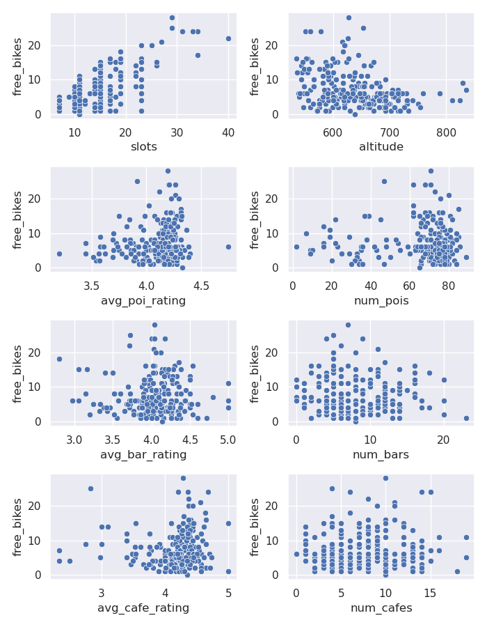
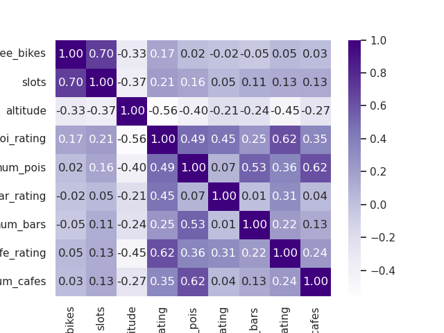
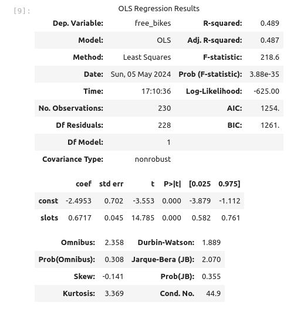
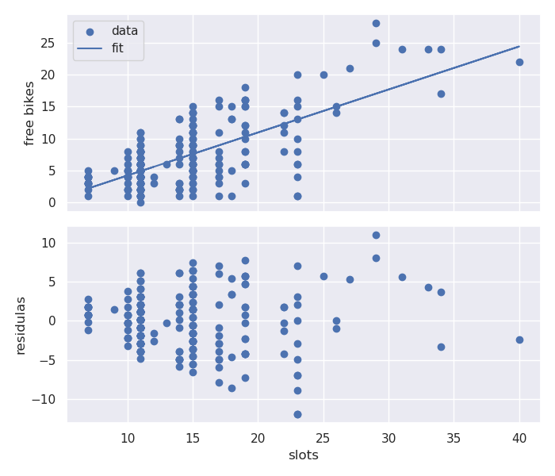
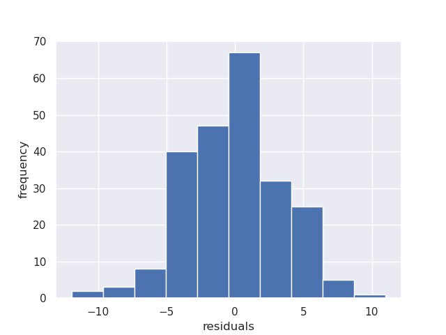

# Lighthouse Labs Data Science Bootcamp Project: Statistical Modelling with Python

## Project/Goals
The purpose of this project was to investigate which dependent variables were significant in predicting the number of bikes available at bike stations in Santiago, Chile. I considered geographical data including latitude, longitude, and altitude as well as the total number of bike slots per bike station. I also considered the number of nearby amenities and points of interest including bars and cafes as well as the Yelp ratings of those amenities.

## Process

### Get data from CityBikes

The first step was to collect data on bike availability in Santiago, Chile (or some other city of my choosing) using the [CityBikes API](https://api.citybik.es/v2/). This API returns number of free bikes, number of bike slots as well as each bike station's latitude, longitude, name, and ID. Nominally, the API also return each bike stations altitude; however, all such return values were 0.0. Fortunately, I was able to fill in the missing data using the [Open-Elevation API](https://www.open-elevation.com/). 

### Get data from Foursquare and Yelp

The next step in the project was to collect data concerning nearby points of interest (POI) from both [Foursquare Place Search](https://docs.foursquare.com/developer/reference/place-search) and [Yelp BUsinesses Search](https://docs.developer.yelp.com/reference/v3_business_search). For the purposes of this study, I defined nearby as within 1000 m. Both APIs return a set of POIs, categorized as bars, cafes, restaurants, *etc...* However, I felt that the Yelp data would be more useful as it contained information such as number of ratings, average rating, and price that was not returned by Foursquare. For this reason, I chose to continue working with the Yelp data rather than the Foursquare data. 

### Clean the data

The next step was data cleaning and EDA. I focused on

  - removing irrelevant data
  - removing duplicate data
  - fixing structural errors
  - converting types
  - handling missing data
  - dealing with outliers
  - standardizing data
  - validating the data
  - encoding data

### Join the datasets

The next step was joining the CityBikes data to the Yelp businesses data using bike staition ID. Furthermore, the Yelp data had to be aggregated by bike station to generate potential predictors. I chose numbers of nearby POIs, numbers of nearby bars, and numbers of nearby cafes along with the average Yelp ratings of those same categories as potential predictors.

The collected data was backed up to a SQLite database. In choosing which version of the data to backup, I chose to backup the raw dataset rather than the one containing aggregations by POI category. Aggregations can, of course, be re-done, but they generally cannot be undone. 

## Results

On the whole, I'd have to say that my results were a little underwhelming.

In the following figure, I scatter plot the number of free bikes against each potential predictor from my dataset: number of bike slots, altitude, average POI rating, number of nearby POIs, average bar rating, number of nearby bars, average cafe rating, and number of nearby cafes. The figure suggests that number of bike slots is moderately to strongly correlated with number of free bikes while the other potential predictors have weak correlations with number of free bikes. This will be confirmed quantitatively by a linear regression analysis. 

I draw the same conclusions from the following heat map of the dataset's correlation matrix.

In performing a linear regression analysis of the dataset, with number of free bikes as the dependent variable, I began with number of bike slots, altitude, and average POI rating as independent variables. The initial model fit yielded an adjusted R-squared of 0.49 (to two significant figures). Unsurprisingly, the p-values corresponding to altitude and average POI rating were high. Removing these independent variables one at a time had no real impact on the adjusted R-squared, and left me with the model parameters and statistics indicated below. 

The linear regression model obtained was

$\mathrm{FreeBikes} = 0.6717*\mathrm{Slots} - 2.4953$.

To judge the goodness of fit, I plotted the actual data along with the fit line as well as a scatter plot of the residuals.

To the naked eye, there doesn't seem to be any pattern to the residuals which is a good sign. To provide further justification, I plotted a histogram of the residuals.

Based on the above figure, I'd say that the residuals are moderately well-approximated by a normal distribution centred at zero (but skewed slightly to the left).

In summary, of all the potential predictors I investigated as being highly correlated with number of free bikes at bike stations in Santiago, Chile, only number of bike slots appears to be significant: the number of bike slots is positively correlated with the number of free bikes with a correlation of 0.70.

## Challenges 

Like many projects, the main challenge with this one was trying to decide what analyses were actually worth doing given the time constraints. As noted above, only one of the independent variables I considered turned out to be significant. So, if I were to start again from scratch, I would look for other possible predictors.

Another significant challenge of this project concerned the treatment of outliers. The approach I settled on was to keep outliers in the CityBikes data but drop outliers from the Yelp data. My reasoning was that the CityBikes data (for Santiago, Chile) was a population, not a sample, so sampling biases were not a factor. Also, none of the CityBikes outliers suggested errors in data collection of entry. 

## Future Goals

If I had more time to work on this project, I would

- Re-engineer the structure of my initial database. Initially, I had three tables in my database, but I think it would be better to add a pair of bridging tables to disentangle a pair of many-to-many relationships.
- Do more testing and error checking. I tried to be careful with data collection and cleaning, but writing some automated routines that ensure data quality would be useful.
- Verify independently the resuls of the open-elevation API.
- Refactor my Foursquare and Yelp data collection functions. There's significant overlap between functions written for Foursquare and for Yelp. My code could be more DRY.
- Find a way to loop over a sequence of DataFrame pipes. Cutting-and-pasting code was fine for eight pipes, but it wouldn't be fine for 100 pipes.
- **Revisit my choice of potential predictors in an effort to determine other variables that are highy correlated with number of free bikes.** 
