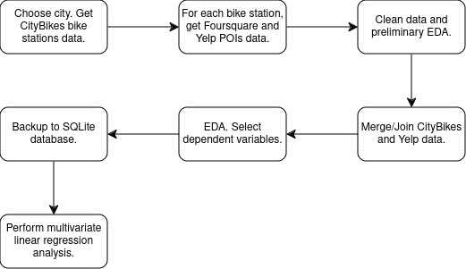
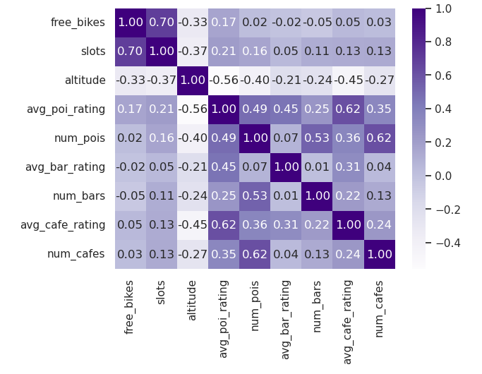

# Lighthouse Labs Data Science Bootcamp Project: Statistical Modelling with Python

## Project/Goals

The purpose of this project was to investigate which dependent variables were significant in predicting the number of bikes available at bike stations in Santiago, Chile. I considered geographical data including latitude, longitude, and altitude as well as the total number of bike slots per bike station. I also considered the number of nearby amenities and points of interest including bars and cafes as well as the Yelp ratings of those amenities.

## Process

Here is a a process flow diagram for this project:

In the following, we elaborate on each step.

### Get data from CityBikes

The first step was to collect data on bike availability in Santiago, Chile (or some other city of my choosing) using the [CityBikes API](https://api.citybik.es/v2/). This API returns number of free bikes, number of bike slots as well as each bike station's latitude, longitude, name, and ID (as well as some other information). Nominally, the API also returns each bike station's altitude; however, all such return values were 0.0. Fortunately, I was able to fill in the missing data using the [Open-Elevation API](https://www.open-elevation.com/). 

### Get data from Foursquare and Yelp

The next step in the project was to collect, for each bike station, data on nearby points of interest (POI) from both [Foursquare Place Search](https://docs.foursquare.com/developer/reference/place-search) and [Yelp BUsinesses Search](https://docs.developer.yelp.com/reference/v3_business_search). For the purposes of this study, I defined nearby as within 1000 m. Both APIs return a collection of POIs, categorized as bars, cafes, restaurants, *etc...* However, I felt that the Yelp data would be more useful than the Foursquare data as it contained information such as number of ratings, average rating, and price that was not returned by Foursquare. For this reason, I chose to proceed with my analysis using the Yelp data rather than the Foursquare data. 

### Explore and clean the data

The next steps were data cleaning and EDA. I focused on

  - **Removing irrelevant data:** I dropped timestamps as all bike station data was collected at the same time. Also, I dropped a few other columns as they either contained redundant or uninteresting (*e.g.,* constant) information.
  - **Removing duplicate data:** Deduplication was needed as many POIs were within 1 km of more than one bike station.
  - **Converting types:** No type conversions were necessary.
  - **Fixing structural errors:** For all POI category names, I converted to lower case, trimmed leading and trailing white space, and replaced all consecutive white space characters with a single space. 
  - **Handling missing data:** From all DataFrames, only one column, price, had missing data. There wasn't really anything I could do to fill in the missing values, however. In adddition, all bike station altitudes were listed as 0.0 which is incorrect. Fortunately, I was able to fill in this missing data from another API (discussed above). 
  - **Dealing with outliers:** I looked through the CityBikes data for outliers indicative of data entry errors, but didn't find any. As for the Yelp data, I eliminated outliers a but further along in the analysis.
  - **Validating the data:** Where possible, I checked some common-sense data constraints, *e.g.,* number of bikes must be non-negative, price must be a string of dollar signs, latitude must be between -90 deg. and +90 deg. No problems were identified.
  - **Encoding data:** I converted the price dollar-sign strings to an integer (the number of dollar signs in the price string).

### Join the datasets

The next step in the analysis was joining the CityBikes data to the Yelp POIs data using bike staition ID. Also, the Yelp data had to be aggregated by bike station to generate potential good predictors. **From the Yelp data, I chose numbers of nearby POIs, numbers of nearby bars, and numbers of nearby cafes along with average Yelp ratings of those same categories as potential predictors. To this set, I added number of bike slots and altitude from the CityBikes data.** After aggregation, I removed outliers from the Yelp data. While there was no evidence of data errors, online reviews are definitely susceptible to sampling bias and other issues.

The collected data was backed up to a SQLite database. In choosing which version of the data to backup, I chose to backup the raw dataset rather than the one containing aggregations by POI category. Aggregations can, of course, be re-done, but they generally cannot be undone. 

### Perform a regression analysis

With number of free bikes as the dependent variable and the collection discussed above as the independent variables, I performed a multivariate linear regression analysis.

## Results

On the whole, I'd have to say that my results were a little underwhelming.

In the following figure, I scatter plot the number of free bikes against each potential predictor from my dataset: number of bike slots, altitude, average POI rating, number of nearby POIs, average bar rating, number of nearby bars, average cafe rating, and number of nearby cafes. The figure suggests that number of bike slots is moderately to strongly correlated with number of free bikes while the other potential predictors have weak correlations with number of free bikes. This will be confirmed quantitatively by a linear regression analysis. 

I draw essentially the same conclusions from the following heat map of the dataset's correlation matrix.

In performing a linear regression analysis of the dataset, with number of free bikes as the dependent variable, I began with number of bike slots, altitude, and average POI rating as independent variables. The initial model fit yielded an adjusted R-squared of 0.49 (to two significant figures). Unsurprisingly, the p-values corresponding to altitude and average POI rating were high. Removing these independent variables one at a time had no real impact on the adjusted R-squared, and left me with the model parameters and statistics indicated below. 

The linear regression model obtained was

$\mathrm{FreeBikes} = 0.6717*\mathrm{Slots} - 2.4953$.

In order to judge the goodness of fit, I plotted the actual data along with the fit line as well as a scatter plot of the residuals.

To the naked eye, there doesn't seem to be any pattern to the residuals which is a good sign. To provide further justification that the linear regression model obtained was reasonable, I plotted a histogram of the residuals.

Based on the above figure, I'd say that the residuals are *moderately* well-approximated by a normal distribution centred at zero, but the above histogram is quite clearly skewed to the left.

### Conclusions

In summary, of all the potential predictors I investigated in an effort to find variables highly correlated with number of free bikes at bike stations in Santiago, Chile, only the number of bike slots appears to be significant: the number of bike slots is positively correlated with the number of free bikes with a correlation of 0.70. A linear regression model finds that $(\mathrm{FreeBikes} = 0.6717*\mathrm{Slots} - 2.4953)$ with an R-squared of 0.49. A followup analysis of residuals suggest that this is a reasonable (but not great!) model.

## Challenges 

The main challenge with this project was in selecting which features of the dataset were worth an in-depth analysis given the project deadline. As noted above, only one of the independent variables I considered turned out to be significant. So, if I were to start again from scratch, I would look for other possible predictors of significance. Options include average price, number and average rating of nearby restaurants, and maximum distance from the bike station. 

Another significant challenge of this project concerned the treatment of outliers. The approach I settled on was to keep outliers in the CityBikes data but drop outliers from the Yelp data. My reasoning was that the CityBikes data (for Santiago, Chile) was a population, not a sample, so sampling biases were not a factor. Also, none of the CityBikes outliers suggested errors in data collection of entry. The Yelp data, on the other hand, definitely represents a sample of people's opinion on the businesses in question, and, as such, is susceptible to sampling bias and other problems.

## Future Goals

If I had more time to work on this project, I would

- **Revisit my choice of potential predictors in an effort to determine other variables that are highy correlated with number of free bikes.** 
- Re-engineer the structure of my initial database. Initially, I had three tables in my database, but I think it would be better to add a pair of bridging tables to disentangle a pair of many-to-many relationships.
- Do more testing and error checking. I tried to be careful with data collection and cleaning, but writing some automated routines that ensure data quality would be more efficient in the long run.
- Verify independently the results of the open-elevation API.
- Refactor my Foursquare and Yelp data collection functions. There's significant overlap between functions written for Foursquare and for Yelp. My code could be more DRY.
- Find a way to loop over a sequence of DataFrame pipes. Cutting-and-pasting code was fine for eight pipes, but it wouldn't be fine for 100 pipes.
